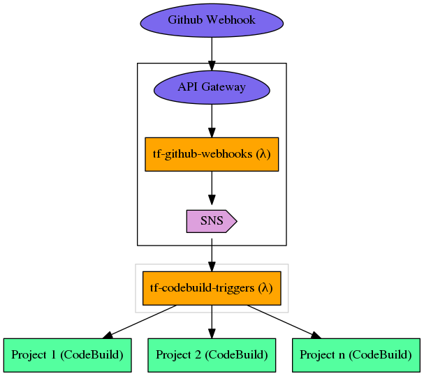

# pa-analytics-trainee-progress
a `node.js` lambda function that publishes authorized github events to SNS

<p align="center">

</p>

## Installing
```shell
# clone this repository
$ git clone git@github.com/cludden/tf-github-webhooks.git

# if developing locally
$ cd tf-github-webhooks && nvm use && npm install
```

## Contributing
1. Clone it (`git clone git@github.com:cludden/tf-github-webhooks.git`)
1. Create your feature branch (`git checkout -b my-new-feature`)
1. Commit your changes using [conventional changelog standards](https://github.com/bcoe/conventional-changelog-standard/blob/master/convention.md) (`git commit -am 'feat: adds my new feature'`)
1. Push to the branch (`git push origin my-new-feature`)
1. Ensure linting/security/tests are all passing
1. Create new Pull Request

## Testing
This project uses:
- [docker](https://www.docker.com/) for consistent testing and build environments.

**Prerequisities**:
- [Docker CE & Compose](https://store.docker.com/search?offering=community&type=edition)

**Testing:**
```shell
# run all tests
$ docker-compose run tf-github-webhooks
```

**Linting:**
```shell
# run lint
$ docker-compose run tf-github-webhooks npm run lint
```

**Security:**
```shell
# run security check
$ docker-compose run tf-github-webhooks npm run sec
```

## Building
To build locally:
```shell
$ docker-compose run tf-github-webhooks npm run build
```

## Releasing
1. Merge fixes & features to master
1. Run lint check `npm run lint`
1. Run security check `npm run sec`
1. Run full test suite `docker-compose run tf-github-webhooks`
1. Run release script `npm run release`
1. Push release & release tag to github `git push --follow-tags`
1. [Publish new release](https://help.github.com/articles/creating-releases/) in github, using the release notes from the [CHANGELOG](./CHANGELOG)

## Deploying and Configuring
1. Build the artifact and push to `s3`
1. Use the terraform module
```
module "github_webhooks" {
    source                = "git::git@github.com:cludden/tf-github-webhooks.git//terraform?ref={version}"
    config_parameter_name = "/secrets/tf-github-webhooks"
    debug                 = ""
    log_level             = "info"
    memory_size           = 128
    name                  = "github-webhooks"
    node_env              = "production"
    region                = "us-west-2"
    s3_bucket             = "my-artifact-bucket"
    s3_key                = "path/to/my/artifact.zip"
    timeout               = 10
}
```

## LICENSE
Licensed under the [MIT License](LICENSE.md)

Copyright (c) 2017 Chris Ludden
